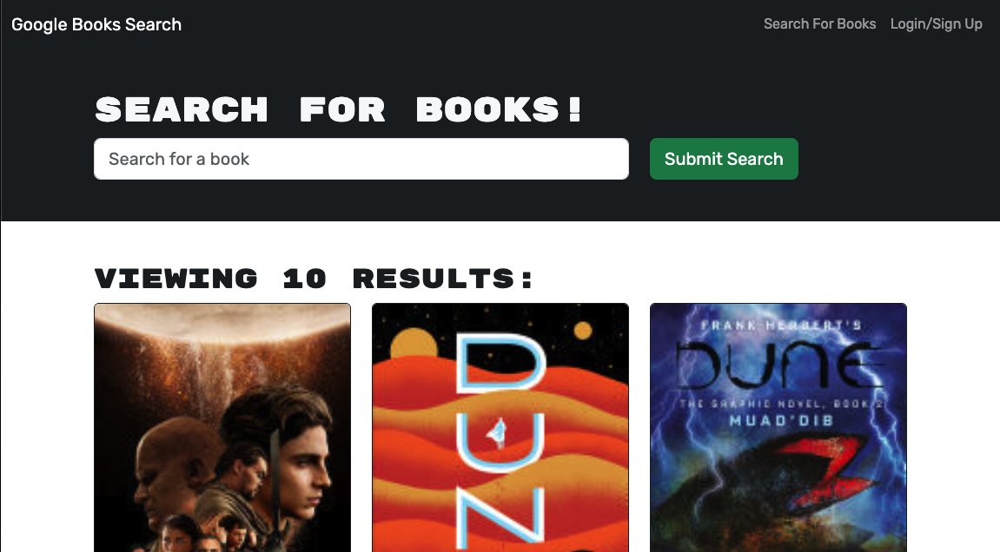

# Book Search Engine with GraphQL and MongoDB

## Description

This application is a refactoring of a book search website to change it from a RESTful API to a GraphQL API built with Apollo Server. The app utilizes the MERN stack with a React front end, MongoDB database, and Node.js/Express.js server and API. Users can sign up/login and save book searches to the database.

This required me to set up an Apollo Server to use GraphQL queries and mutations to fetch and modify data to replace the RESTful API. I also edited the existing authentication middleware so that it works in a GraphQL context. Also created the Apollo Provider sot hat requests could communicate with the Apollo Server. Finally the site is deployed on Heroku with a MongoDB database using MongoDB Atlas.

## Installation

If you so choose to install this application and play with the code, first download the repository and open in your preferred code editor. Run `npm install` to download the necessary npm package dependencies, found in the package.json. Finally, run the application from your local device by running the command `npm run develop`.

## Usage

The application can be reached at the deployed site [here](https://final-book-9716511ee496.herokuapp.com/). From the homepage the user can sign up or log in via the link in the navbar. The user can also search for books by using the searchbar underneath the header. Once logged in the user can save books they have searched for and view that list via the 'saved books' link in the navbar, which appears once logged in. From that list users can also delete any books they have previously saved. 

## Credits

Link to starter code: https://github.com/coding-boot-camp/solid-broccoli

## Badges

